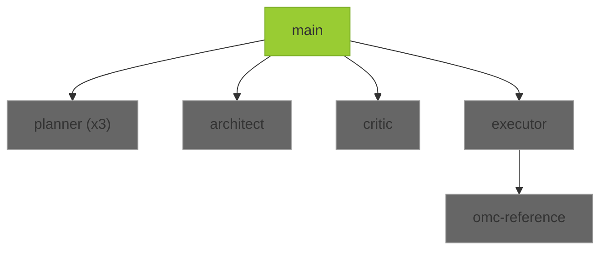

# Roadmap — post-v0.2.0 candidates

Options considered after v0.2.0 shipped. None are committed — the
intent is to run v0.2.0 in real use first and promote whichever
items actually earn their keep.

Each section includes enough scope, design, and gotchas to be
actionable later without reconstructing the reasoning.

---

## 1. Idle / Rest — real-usage observation

**What**: No new features. Run v0.2.0 daily against live Claude Code
sessions for a week or two. Collect real pain points.

**Why it earns its keep**:
- Imagined improvements ≠ real ones. Real friction bubbles up only
  during actual use.
- Validates current design limits (e.g. "parallel 3 works, but what
  about 6?").
- Surfaces stability issues in long sessions (memory, rotation bugs).
- Provides data to prioritize the other options in this file
  instead of guessing.

**How to run it**:
- Keep `agentlens` open during ordinary Claude Code work.
- Maintain an `observations.md` scratch file for annoyances or
  surprises as they happen.
- After ~1 week, review the observations list and pick the single
  biggest pain point.

**Cost**: zero hours, some patience.

---

## 2. Phase 2b — Nested instance routing

**What**: When a subagent itself spawns another agent or skill,
render the nested spawn as a child under its SPECIFIC parent
instance in running mode (not aggregated at node level).

### Before (v0.2.0)

```
main
 ├── executor (instance A)
 ├── executor (instance B)
 └── omc-reference          # aggregated — lost the parent link
```

### After

```
main
 ├── executor#A
 │   └── omc-reference      # spawned from A's subagent file
 └── executor#B
     └── plan               # spawned from B's subagent file
```

### Implementation sketch

- Add `Instance.nested_children: list[tuple[str, str]]` (child_node_id
  + tool_use_id).
- `_handle_nested_spawn` currently finds the parent via
  `_subagent_uuid_to_node`. Switch to `_subagent_uuid_to_instance`
  (already built in Phase 2a) so the nested spawn attaches to the
  right Instance.
- Running-mode subgraph builder walks `instance.nested_children` and
  emits nested virtual nodes with composite ids like
  `agent:executor#<tid>/skill:plan#<tid>`.
- Edge routing becomes parent-virtual → child-virtual.

### Gotchas

- Claude Code currently **does not grant Task tool to subagents**.
  The only nested spawn path available is `Skill(...)` from inside a
  subagent. So in practice this feature is limited to one level of
  nesting until the Task restriction lifts.
- Cross-highlight and drill-down both need mode-aware routing (base
  id vs composite virtual id).
- Expect 12–15 new tests covering instance ancestry, nested edge
  rewriting, and cross-highlight fallback.

### Cost

- Implementation: ~2–3h.
- Tests: ~1h.
- Risk: medium — touches graph model, layout, panel, and drill-down.

### When to do it

Only if repeated real use shows you cannot tell which parallel
parent spawned which nested child, AND Claude Code grants Task
tool to subagents (or you start exercising Skill-inside-subagent
patterns heavily).

---

## 3. Activity sparkline (D1)

**What**: A small ASCII sparkline in the footer showing events-per-
second over the last N seconds. Gives an at-a-glance "heartbeat" of
the attached session.

### Visual

```
events/s (last 60s): ▂▂▃▃▅▆▅▃▂▁▁▁▁▂▃▅▆█▇▅▃▂▂▁▁▁▁▁▁▂▃  peak: 32/s
```

### Implementation sketch (~60 LOC)

```python
from collections import deque
import time

SPARKLINE_CHARS = " ▁▂▃▄▅▆▇█"

class ActivityTracker:
    def __init__(self, window_secs: int = 60):
        self.window = window_secs
        self.buckets: deque[int] = deque([0] * window_secs, maxlen=window_secs)
        self._last_tick = int(time.monotonic())

    def record(self) -> None:
        self._maybe_rotate()
        self.buckets[-1] += 1

    def _maybe_rotate(self) -> None:
        now = int(time.monotonic())
        delta = now - self._last_tick
        if delta > 0:
            for _ in range(min(delta, self.window)):
                self.buckets.append(0)
            self._last_tick = now

    def render(self) -> str:
        self._maybe_rotate()
        peak = max(self.buckets) or 1
        chars = [SPARKLINE_CHARS[min(8, (c * 8) // peak)] for c in self.buckets]
        return "".join(chars) + f"  peak: {peak}/s"
```

- Hook it into `AgentlensApp.on_harness_event_message` via
  `self._activity.record()`.
- Add to `_update_footer` / `_refresh_idle_footer` output.
- Respect the existing footer wrap behavior.

### Value

- Instant "is the session busy or stuck?" answer.
- Surfaces spikes retroactively via the peak count.
- Fun to look at.

### Cost

- ~1–2h including a unit test on bucket rotation and peak
  computation.

### Gotchas

- Footer is already wrap-aware; adding another line pushes the
  total toward `max-height: 3`. Keep the sparkline compact.
- Rendering every second is fine, but be careful not to re-render
  the entire footer string unnecessarily.

---

## 4. Mermaid export (D2)

**What**: Press a key to dump the current flowchart as a Mermaid
text file. Paste into a GitHub README or PR description and it
renders automatically.

### Example output



### Implementation sketch

- New `exporters/mermaid.py` (~80 LOC).
- `render_mermaid(graph: CallGraph, orientation: str) -> str`.
- Sanitize node ids (Mermaid forbids certain characters).
- Respect current orientation: `graph LR` vs `graph TD`.
- Color by status via `classDef` / `class ...`.
- Keybinding `x` → `action_export_mermaid` writes to
  `.omc/exports/flowchart-YYYYMMDD-HHMMSS.mmd`.
- Optional: also copy to clipboard via `pyperclip` (new soft
  dependency).

### Value

- Shareable snapshots for blog posts, PR reviews, team
  discussions.
- Archivable record of a notable session.

### Cost

- ~1h implementation + 3–4 tests.

### Gotchas

- Mermaid looks clean up to ~30 nodes; above that it becomes a
  spaghetti. Consider exporting only the current `_running_subgraph`
  or a user-selected subtree if you use this for big sessions.
- Single-user tool — the share-ability value depends on actually
  having someone to share with.

---

## 5. Session replay slider (D3)

**What**: A scrubber widget below the Timeline that lets you move
the flowchart back in time. Drag the slider, flowchart rebuilds to
that moment's state.

### Visual

```
├─────────────────────────────────────────────────────────────────┤
│ ◀ [━━━━━●━━━━━━━━━━━━━━━━━━] ▶  14:02:15 / 14:08:32 (35%)      │
└─────────────────────────────────────────────────────────────────┘
```

### Interaction

- `←/→` step one event back/forward.
- Slider drag (or `PgUp/PgDn` reassigned) for big jumps.
- `End` returns to live mode.
- `Home` jumps to first event.
- While scrubbing, timeline stays live but flowchart is frozen.

### Implementation

- New `panels/replay_slider.py` Widget (~100 LOC).
- Add `CallGraph.snapshot() -> CallGraphSnapshot` and
  `CallGraph.restore(snapshot)`. Snapshots are deep copies of
  nodes, edges, and the instance maps.
- Sample a snapshot every N seconds or every K events so scrub is
  cheap: find nearest prior snapshot, forward-replay events up to
  the target time.
- `App` gains `_replay_mode: bool`. In replay mode, new events
  update Timeline but the Flowchart is frozen on the scrub target.

### Value

- Post-mortem debugging: "what did the graph look like at 14:03:22?"
- Slow-motion study of complex orchestrations.
- Teaching tool for visualizing multi-agent flows.

### Cost

- ~3–4h, and it's the heaviest option by far.
- Non-trivial new UI widget.
- Snapshot memory overhead on long sessions.

### Gotchas

- The graph model is mutable and stateful; snapshot/restore must be
  careful about aliasing (deep copy or immutable snapshot).
- Live mode vs scrub mode requires careful state management to
  avoid the flowchart flickering back to live on unrelated events.
- Worth it only if you actually need post-mortem debugging.
  Typically, live mode + drill-down is enough.

---

## 6. Manual AC verification (from the original spec)

**What**: Complete the two remaining manual verification items from
the deep-interview spec's Definition of Done. These were left
`[pending]` in the README Manual Verification section.

### M-AC8-idle (footer shows "session idle" after 30s)

**Procedure**:
1. `agentlens --latest` in one terminal.
2. Stop any activity in Claude Code for 35 seconds.
3. Expect the footer to append `— session idle`.
4. Confirm `j` / `k` still move the Timeline cursor.
5. Record the timestamp and pass/fail in
   `README.md → ## Manual Verification → M-AC8-idle`.

### M-AC11 (idle CPU ≤ 2%)

**Procedure**:
1. Terminal A: `agentlens --latest`.
2. Terminal B: `top -pid $(pgrep -f agentlens) -stats cpu`.
3. Observe for 30 seconds while the session is idle.
4. Record the average CPU% in
   `README.md → ## Manual Verification → M-AC11`.

### DoD #3 — live session evidence (optional)

**Procedure**:
1. Start `script(1)` or a screen recorder in a terminal.
2. Run `agentlens --latest` inside that recorded terminal.
3. Do real Claude Code work for 30–60 seconds so events come in.
4. Stop recording. Drop the artifact in `docs/evidence/`.

### Cost

- M-AC8-idle + M-AC11: ~15 minutes total.
- DoD #3: extra 5–10 minutes for recording setup.

### When to do it

Whenever you're already in the TUI for other reasons. This
completes the original spec's Definition of Done without any code
changes.

---

## Priority matrix (at time of writing)

| Option | Value | Cost | Use frequency | Implementation fun | Overall |
|---|---|---|---|---|---|
| 1. Rest | feedback data | 0h | — | — | ⭐⭐⭐⭐ |
| 2. Phase 2b | limited by Claude Code | 2–3h | low-med | medium | ⭐⭐ |
| 3. Sparkline | medium | 1–2h | medium | high | ⭐⭐⭐ |
| 4. Mermaid | share-only | 1h | low | medium | ⭐⭐ |
| 5. Replay slider | debug-only | 3–4h | low | high | ⭐⭐ (overkill) |
| 6. AC verification | completeness | 0.5h | — | low | ⭐⭐⭐⭐ |

## Recommended combinations

- **Minimal finish**: 6 + 1. Close out the original spec, then rest.
- **Small extras**: 6 + 3 + 1. Add the sparkline for fun, then rest.
- **Pure rest**: 1 only. Stop and observe.

Promotion rule for anything in this file: **only if a week of real
use surfaces the specific pain it addresses**. Otherwise it's just
speculative work.
