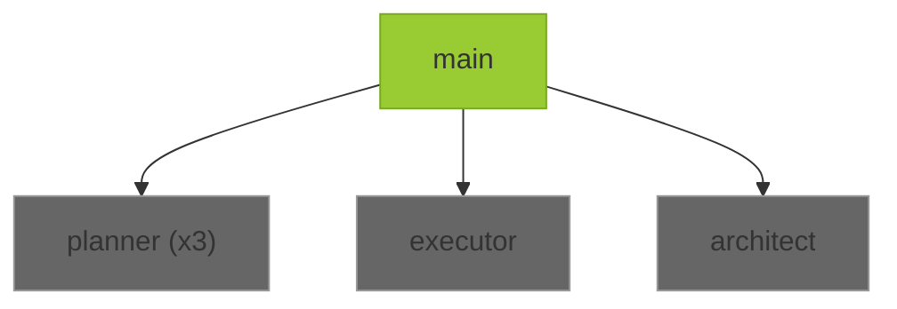

# Roadmap — post-v0.9.0 candidates

Options considered after v0.9.0 shipped. None are committed — the
intent is to run the current version in real use and promote whichever
items actually earn their keep.

Each section includes enough scope, design, and gotchas to be
actionable later without reconstructing the reasoning.

---

## Completed (for historical reference)

| Version | Feature |
|---------|---------|
| v0.2.0 | Subagent watcher, per-instance drill-down, session picker, `Shift+S` path input, Windows/git-bash cwd-match fallback |
| v0.8.0 | Turn Summary modal — Tool Usage, MCP, Hooks, Token Usage sections |
| v0.8.1 | Subagent token breakdown in Turn Summary; OMC team agent attribution fix (`.meta.json` → OMC name mapping, `_name_to_node` lazy resolve) |
| v0.9.0 | Activity Sparkline in status footer (8-bar events/sec histogram, `peak: N/s`, narrow-terminal suppression) |
| v0.9.0 | Harness: 7 agents, 9 skills (incl. orchestrator), model routing (haiku/sonnet/opus + dynamic promotion), Phase 1→1.5→2→3→4 pipeline with QA retry loop (max 3) |
| v0.9.2 | Nested spawn FlowRecord + tree topology (nested children now appear under parent node in flow mode) |
| v0.9.3 | Panel focus-based key routing (`↑`/`↓`/`j`/`k` routed to active panel); active panel green border; timeline cursor snap-to-bottom bug fix (`_highlight_from_timeline` flag + `_do_scroll_to_end` guard) |
| v0.9.6 | Turn Summary mini timeline — per-turn tool call DataTable (time/tool/agent/sts/dur), `TurnRecord.tool_events`, `MAX_TOOL_EVENTS=200` |
| v0.9.7 | Timeline turn-only mode — main Timeline shows only turn markers (ts / Turn N / prompt / tool count / duration); tool-level detail via TurnSummaryScreen (Enter); ToolDetailScreen dead code removed from app.py |
| v0.9.8 | TurnSummaryScreen fixed header — Turn / Prompt / Duration / token summary line pinned to top; scrollable body holds Agents/Skills, Tool Usage, MCP, Hooks, Token Usage detail, Tool Calls DataTable; token usage visible without scrolling |
| Unreleased | TurnSummaryScreen 4-section independent scroll — Token Usage / Agents·Skills / Tool Usage+MCP+Hooks / Tool Calls DataTable each get `height: 1fr`; no section crowds another; display caps (`+N more`) removed |
| Unreleased | Timeline auto-scroll to latest turn on startup — `_do_scroll_to_end` catch-up guard uses snapshot to distinguish bulk ingestion from manual scroll |
| Unreleased | Flowchart layout coalescing — dirty flag + `call_after_refresh` batches N events per frame, eliminates startup slowness on large sessions |
| Unreleased | Flowchart cross-highlight fix — Timeline `j`/`k` cursor now propagates active turn to Flowchart (same as `[`/`]`) |
| — | M-AC8-idle automated (test_idle_footer.py); M-AC11 measured at 0.16% idle CPU |

---

## 1. Idle / Real-usage observation

**What**: No new features. Run v0.9.0 daily against live Claude Code
sessions. Collect real pain points.

**Why it earns its keep**:
- Imagined improvements ≠ real ones. Real friction bubbles up only
  during actual use.
- Validates current design limits (e.g. "parallel 3 agents works,
  but what about 6?").
- Surfaces stability issues in long sessions (memory, rotation bugs).
- Provides data to prioritize the other options in this file
  instead of guessing.

**How to run it**:
- Keep `agentlens` open during ordinary Claude Code work.
- Note annoyances or surprises as they happen.
- After ~1 week, pick the single biggest pain point.

**Cost**: zero hours, some patience.

---

## 2. Phase 2b — Nested instance routing

**What**: When a subagent itself spawns another agent or skill,
render the nested spawn as a child under its **specific parent
instance** in running mode (not aggregated at node level).

### Before (current)

```
main
 ├── executor (instance A)
 ├── executor (instance B)
 └── omc-reference          # aggregated — lost the parent link
```

### After

```
main
 ├── executor#A
 │   └── omc-reference      # spawned from A's subagent file
 └── executor#B
     └── plan               # spawned from B's subagent file
```

### Implementation sketch

- Add `Instance.nested_children: list[tuple[str, str]]` (child_node_id
  + tool_use_id).
- `_handle_nested_spawn` currently finds the parent via
  `_subagent_uuid_to_node`. Switch to `_subagent_uuid_to_instance`
  so the nested spawn attaches to the right Instance.
- Running-mode subgraph builder walks `instance.nested_children` and
  emits nested virtual nodes with composite ids like
  `agent:executor#<tid>/skill:plan#<tid>`.
- Edge routing becomes parent-virtual → child-virtual.

### Gotchas

- Claude Code currently **does not grant Task tool to subagents**.
  The only nested spawn path available is `Skill(...)` from inside a
  subagent. So in practice this feature is limited to one level of
  nesting until the Task restriction lifts.
- Cross-highlight and drill-down both need mode-aware routing (base
  id vs composite virtual id).
- Expect 12–15 new tests covering instance ancestry, nested edge
  rewriting, and cross-highlight fallback.

### Cost

- Implementation: ~2–3h.
- Tests: ~1h.
- Risk: medium — touches graph model, layout, panel, and drill-down.

### When to do it

Only if repeated real use shows you cannot tell which parallel
parent spawned which nested child, AND Claude Code grants Task
tool to subagents (or Skill-inside-subagent patterns become heavy).

---

## 3. Mermaid export

**What**: Press a key to dump the current flowchart as a Mermaid
text file. Paste into a GitHub README or PR description and it
renders automatically.

### Example output


```mermaid
graph TD
    main[main]
    planner["planner (x3)"]
    architect[architect]
    executor[executor]

    main --> planner
    main --> executor
    main --> architect

    classDef done fill:#666,stroke:#999
    classDef running fill:#9c3,stroke:#7a2
    class planner,architect,executor done
    class main running
```

### Implementation sketch

- New `exporters/mermaid.py` (~80 LOC).
- `render_mermaid(graph: CallGraph, orientation: str) -> str`.
- Sanitize node ids (Mermaid forbids certain characters).
- Respect current orientation: `graph LR` vs `graph TD`.
- Color by status via `classDef` / `class ...`.
- Keybinding `x` → `action_export_mermaid` writes to
  `.omc/exports/flowchart-YYYYMMDD-HHMMSS.mmd`.
- Optional: also copy to clipboard via `pyperclip` (new soft dep).

### Value

- Shareable snapshots for blog posts, PR reviews, team discussions.
- Archivable record of a notable session.

### Cost

- ~1h implementation + 3–4 tests.

### Gotchas

- Mermaid looks clean up to ~30 nodes; above that it becomes a
  spaghetti. Consider exporting only the `_running_subgraph` or a
  user-selected subtree if you use this for big sessions.
- Single-user tool — the share-ability value depends on actually
  having someone to share with.

---

## 4. Session replay slider

**What**: A scrubber widget below the Timeline that lets you move
the flowchart back in time. Drag the slider, flowchart rebuilds to
that moment's state.

### Visual

```
├─────────────────────────────────────────────────────────────────┤
│ ◀ [━━━━━●━━━━━━━━━━━━━━━━━━] ▶  14:02:15 / 14:08:32 (35%)      │
└─────────────────────────────────────────────────────────────────┘
```

### Interaction

- `←/→` step one event back/forward.
- Slider drag (or `PgUp/PgDn` reassigned) for big jumps.
- `End` returns to live mode.
- `Home` jumps to first event.
- While scrubbing, timeline stays live but flowchart is frozen.

### Implementation

- New `panels/replay_slider.py` Widget (~100 LOC).
- Add `CallGraph.snapshot() -> CallGraphSnapshot` and
  `CallGraph.restore(snapshot)`. Snapshots are deep copies of
  nodes, edges, and the instance maps.
- Sample a snapshot every N seconds or every K events so scrub is
  cheap: find nearest prior snapshot, forward-replay events up to
  the target time.
- `App` gains `_replay_mode: bool`. In replay mode, new events
  update Timeline but the Flowchart is frozen on the scrub target.

### Value

- Post-mortem debugging: "what did the graph look like at 14:03:22?"
- Slow-motion study of complex orchestrations.
- Teaching tool for visualizing multi-agent flows.

### Cost

- ~3–4h. Non-trivial new UI widget.
- Snapshot memory overhead on long sessions.

### Gotchas

- The graph model is mutable and stateful; snapshot/restore must be
  careful about aliasing (deep copy or immutable snapshot).
- Live mode vs scrub mode requires careful state management to
  avoid flickering back to live on unrelated events.
- Worth it only if you actually need post-mortem debugging.
  Typically, live mode + drill-down is enough.

---

## 5. Flow-mode improvements

**What**: The `[flow]` mode (third `m` toggle) was added in v0.8.x.
Currently edges connect each node to the "most recent completed
predecessor". Four known problems, ordered by fix priority:

### P1. Parallel spawn collapses into vertical chain `[FIXED in v0.9.1]`

~~When 3 agents spawn from `main` simultaneously, if any one of them
completes (≥0.5s duration) before the next starts, the temporal
heuristic treats it as a sequential predecessor~~

**Resolved**: All FlowRecords now connect directly to ROOT as children
in flow mode (pure fork layout). Temporal predecessor inference removed.
Fixed in v0.9.1.

---

### P2. Nested node children visible in flow `[FIXED in v0.9.2]`

~~When an agent or skill spawned a nested child agent/skill, the child appeared
as a ROOT sibling instead of appearing under its true parent~~ 

**Resolved**: `FlowRecord.parent_node_id` field added to track nested
invocation parentage. `_flow_subgraph()` now builds a tree with `parent_node_id`
edges instead of flattening to ROOT children. Tree depth and edge routing
correctly display nested spawns under their parent. Fixed in v0.9.2.

---

### P3. Running nodes excluded from parent chain `[priority: 2]`

A node only enters `completed_*` after it finishes. While A is still
running, if A spawns B, B's parent resolves to the last completed node
before A (e.g. `main`) instead of A:

```
Actual flow:  main → A → B   (A spawned B mid-run)
Flow display: main → A
              main → B        (A skipped)
```

**Root cause**: `completed_*` only contains nodes where
`ended_ts is not None and duration >= _MIN_REAL_DURATION`.

**Fix**: Introduce a third list `active: list[tuple[float, str]]`
(started_ts, vid) that tracks currently running nodes. When finding a
parent, prefer the deepest active ancestor over completed ones if the
active node's `started_ts < rec.started_ts`. Clear entries from
`active` when the node completes.

**Scope**: `_flow_subgraph()` in `flowchart.py`. ~20 LOC + 3–4 tests.

---

### P4. Description length uncapped `[priority: 3]`

`flow_label = rec.description if rec.description else rec.label`

`all`/`running` modes apply `_display_label()` + `MAX_LABEL_LEN=64`.
Flow mode uses `description` raw — long descriptions overflow node
boxes and break terminal layout.

**Fix**: Truncate `flow_label` at 35 chars with `…` suffix, matching
the `[all]` mode truncation rule.

**Scope**: One line in `_flow_subgraph()`. ~5 LOC + 1–2 tests.

---

### P5. turn=-1 skips filter, shows full history `[priority: 4]`

```python
if turn >= 0:   # turn=-1 (before first user_message) skips this
    history = [r for r in history if r.turn_index == turn]
```

Before the first user message, `get_current_turn_index()` returns
`-1` and the filter is bypassed, showing the entire `_flow_history`
across all turns. Other modes return an empty graph at this point.

**Fix**: Treat `turn < 0` as "no history yet" and return an empty
subgraph, consistent with other modes.

**Scope**: Two lines in `_flow_subgraph()`. ~5 LOC + 1 test.

---

### Cost

- P1: ~1.5h + 4–5 tests. Touches graph model and flowchart. **[FIXED v0.9.1]**
- P2: ~2h + 7 tests. Touches graph model and flowchart. **[FIXED v0.9.2]**
- P3: ~1h + 3–4 tests. Flowchart only.
- P4: ~15min + 1–2 tests. One-liner.
- P5: ~15min + 1 test. One-liner.
- Total remaining: ~1.5h + ~6 tests.

### When to do it

Fix in order (P3 → P4 → P5). P1 and P2 are complete. P3 is next priority
(description length capping for layout stability).

---

## Priority matrix (post-v0.9.0)

| Option | Value | Cost | Frequency | Fun | Overall |
|--------|-------|------|-----------|-----|---------|
| 1. Rest/observe | feedback data | 0h | — | — | ⭐⭐⭐⭐ |
| 2. Nested instance routing | limited until Task unlocks | 3–4h | low | medium | ⭐⭐ |
| 3. Mermaid export | shareable snapshots | 1h | low | medium | ⭐⭐ |
| 4. Replay slider | post-mortem debug | 3–4h | low | high | ⭐⭐ (overkill) |
| 5. Flow-mode improvements (P1–P4) | correctness + polish | ~3h | medium | medium | ⭐⭐⭐ |

## Recommended next steps

- **Minimal**: 1 only. Rest and observe after the v0.9.0 burst.
- **Small polish**: 1 + 5. Fix flow-mode correctness issues (P1 first,
  then P2–P4 in order).
- **New feature**: 1 + 3. Mermaid export is cheap and useful for
  sharing session graphs in PR reviews.

Promotion rule: **only if a week of real use surfaces the specific
pain it addresses**. Otherwise it's speculative work.
